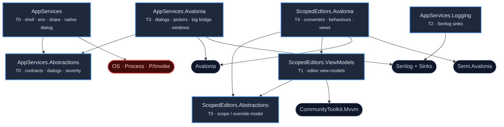

# LayeredEditors — package split and service API shape

Measured from `JanusMael/ClaudeForge` at `6a5c3c5`, not recalled. Companion to
[`plans/00002`](../plans/00002-layerededitors-gets-its-own-repository.md), which still assumes
**five ids in one repository** — this supersedes that shape and the plan needs revising before it
is approved.

## The principle

**A package's identity is its dependency closure.** Every split below is one the code already made
internally and the packaging failed to follow. The buckets are chosen so a future contribution has
an obvious home: needs no UI framework → a `T0` package; needs Avalonia → that family's `.Avalonia`
package. Nothing in between is ambiguous.

⛔ **The measurement that changed the answer.** A first pass reported almost nothing was hoistable.
False negative: the search matched each file's own namespace — every file under
`…LayeredEditors.Avalonia.Services` contains the string `Avalonia.S`. Counting real
`using Avalonia` imports gives the opposite result.

| Today's package | Files importing Avalonia | Files that do not |
|---|---|---|
| `LayeredEditors.Avalonia.Services` | **1 of 11** | 10 |
| `LayeredEditors.Avalonia.Diagnostics` | 7 of 12 | **5** |
| `LayeredEditors.Avalonia` | 22 of 25 | 3 |

`Avalonia.Services` is misnamed twice over: only `AvaloniaDialogService` imports Avalonia, and its
own `<Description>` concedes it — *"Platform-agnostic **and** Avalonia-backed service
implementations."*

## Packages — 7 ids, 2 repositories

Tiers are cumulative dependency weight: **T0** pure .NET · **T1** + CommunityToolkit.Mvvm ·
**T2** + Serilog · **T3** + Avalonia · **T4** + Avalonia + the Semi theme.

| Id | Tier | Contents | Why it is a bucket | Future contributions |
|---|---|---|---|---|
| `Bennewitz.Ninja.AppServices.Abstractions` | **T0** | service contracts and the dialog vocabulary | ⭐ The highest-value hoist — the contracts a test fakes. Today faking `IShellLauncher` costs an Avalonia reference | Clipboard, notifications, single-instance, recent files, theming host |
| `Bennewitz.Ninja.AppServices` | **T0** | `ShellLauncher`, `DefaultEnvironmentProvider`, `DefaultShareService`, `NativeErrorDialog` | Implementations needing an OS, not a UI framework. Usable from a CLI, a service, a test | Process launching, OS integration, native dialogs |
| `Bennewitz.Ninja.AppServices.Logging` | **T2** | `BucketedRollingFileSink`, `LiveLogWindowSink` — **rename required** | A sink is inherently a Serilog thing and inherently **not** a UI thing. This is the one place Serilog is legitimate in this lane | Sinks, formatters, enrichers |
| `Bennewitz.Ninja.AppServices.Avalonia` | **T3 + Serilog** | dialog service, file pickers, `FatalErrorDialog`, `NonFatalNoticeDialog`, `SerilogAvaloniaSink`, `BindingValidationErrorLogger`, `AvaloniaDiagnostics(+Options)` | Avalonia implementations of the contracts in `.Abstractions`, plus the bridge that wires Avalonia's internal logger and its binding errors into Serilog | Avalonia implementations of anything in `.Abstractions`; diagnostics surfaces |
| `Bennewitz.Ninja.ScopedEditors.Abstractions` | **T0** | `IEditorSchema`, `IEditorScope`, `IEditorValue`, `IEditorWorkspace`, `EditorContext`, `EditorValueType`, plus the severity model (`AppSeverity`, `DangerAssessment`, `IDangerClassifier`) | The scope/override model, with only the dialog vocabulary lifted out. Severity stays because **measurement put it here**: `ViewModels` and `.Avalonia` use it, `AppServices` uses none of it | Value types, scope semantics, schema extensions |
| `Bennewitz.Ninja.ScopedEditors.ViewModels` | **T1** | property-editor view-models, factories, navigation, messages | Already **compiler-enforced** framework-free — a control reference is a build error, which keeps editors safe to build off the UI thread | Editor kinds, factories, validation |
| `Bennewitz.Ninja.ScopedEditors.Avalonia` | **T4** | 22 converters, `FileDrop`, `FocusOnRequest`, `DataGridCopyValue`, `JsonHighlightBlock`, `LinkifiedTextBlock`, `TipCell`, 4 views | Honestly named. ⚠ The **only** id binding consumers to **Semi.Avalonia** — that opinion isolated in exactly one place | Views, converters, behaviours, themed controls |

⛔ **Held back from the first release: `LiveLogWindow`, `LiveTailWindow`, `HeaderLink`.** The tail
window is being replaced by a general control built elsewhere, and the live log window's `ItemsControl`
is due a rework. A published id's public types are a promise, so shipping shapes already decided
against buys a breaking change in weeks. They stay in the application until the replacement lands,
then get a home that fits — and if that control is genuinely general it is not a logging type at all,
so it will want a controls package rather than this one.

⭐ This is also what makes the `LiveLogWindowSink` rename necessary rather than cosmetic: it ships
**without** the window it is named after, and it never referenced one. It is a buffer sink, and its
name should say so.

| Repository | Ids | Policy pattern |
|---|---|---|
| `Bennewitz.Ninja.AppServices` | 4 | `Bennewitz.Ninja.AppServices*` |
| `Bennewitz.Ninja.ScopedEditors` | 3 | `Bennewitz.Ninja.ScopedEditors.*` |

⚠ The first pattern has **no dot** before `*`, so it covers the bare stem as well as its suffixed
siblings. The second has one, because no bare-stem id ships there.

⚠ **The cost accepted knowingly:** anyone taking `AppServices.Avalonia` for a file picker also gets
Serilog. That is the one consequence a future consumer inherits and cannot undo, and it is what
would make a later extraction genuinely breaking rather than merely tidy. Acceptable while the
author is the only consumer; written down so it is a decision rather than a discovery.

## Dependency graph

Arrows read **depends on**. Dashed nodes are third-party; the red node is the operating system.



⭐ **THE TWO FAMILIES SHARE NO EDGE.** Measured, not assumed: `ViewModels` and `.Avalonia` use
zero dialog types, and `AppServices` uses zero severity types. So neither family depends on the
other at all, and either could be extracted, versioned or abandoned without touching the other.

⭐ **`AppServices.Abstractions` and `ScopedEditors.Abstractions` have no outgoing edges at all.**
That is the property worth protecting: the two packages a test or a non-UI host consumes reach
nothing. `AppServices.Logging` touches Serilog and nothing else — no window, no Avalonia — and the
log-viewer windows do not reference its sink, so those two never need to be coupled.

## Service API shape

Three questions, one answer: **the signatures are wrong in the same way, and mobile is what exposes it.**

### Make them async

`LaunchTerminalWithCommand`, `RevealInFileManager`, `OpenInDefaultEditor`, `LaunchUrl` and
`SetVariable` are synchronous today.

⛔ **Sync → async is a breaking change; async → sync is never needed.** An async signature wraps a
synchronous implementation for free; a synchronous signature can only wrap an async one by blocking,
which is a deadlock on a UI thread. So the asymmetry decides it — and it is free only before the
first publish.

iOS's `openURL:options:completionHandler:` is genuinely asynchronous, so a mobile `LaunchUrl` has no
synchronous implementation to offer. Use **`ValueTask<T>`**, not `Task<T>`: desktop implementations
complete synchronously and allocate nothing. Take a `CancellationToken` — free now, breaking later.

### Widen the return

`ShellLauncher` has **eight `catch` blocks and eight bare `bool` returns**. Eight distinct causes
arrive at the call site as one bit.

⛔ **The decisive case is mobile, and it is not "failure".** `RevealInFileManager` on a phone is
*unsupported*, not failed — a caller must hide the affordance rather than show an error, and a
`bool` cannot express the difference. The same applies to a terminal launch on any platform without
one.

```csharp
public enum LaunchStatus { Succeeded, Unsupported, NotFound, Denied, Cancelled, Failed }

public readonly record struct LaunchResult(
    LaunchStatus Status, string? Detail = null, Exception? Error = null)
{
    public bool Succeeded => Status is LaunchStatus.Succeeded;
}
```

A `readonly record struct` allocates nothing, and the `Succeeded` property keeps call sites that
only care about yes/no as terse as they are today. This also matches the idiom already present —
`ShareOutcome` is the same move, made once.

### Logging: widen the result first, callback second, never a logger dependency

⭐ **Most of the wanted logging disappears once the result carries the information.** The reason
`DefaultShareService` reached for Serilog is that `ShareOutcome` could not carry *why*. The caller
already owns a logger; give it something worth logging and the dependency is unnecessary.

What a result genuinely cannot carry is narrative — *"tried gnome-terminal, then konsole, then
xterm"*. That is where a callback earns its place:

```csharp
public enum DiagnosticLevel { Debug, Info, Warning, Error }

public delegate void DiagnosticSink(
    DiagnosticLevel level, string message, Exception? error = null);
```

Supplied once via constructor or options, never per call. Zero dependencies, and a consumer adapts
it to `ILogger` in a single lambda.

| Option | Verdict |
|---|---|
| Richer return value | ⭐ **Do this first** — removes most of the need, costs no dependency |
| `DiagnosticSink` delegate | ✅ For narrative a result cannot carry. Package-defined, zero dependency |
| `Action<string>` callback | ⛔ Loses level and exception, so a consumer cannot route or filter |
| Take `ILogger` (`M.E.L.Abstractions`) | ⛔ Not now — imposes MEL's model on every consumer, and it is the dependency `DefaultShareService` explicitly refused |
| Take Serilog directly | ⛔⛔ Forces one logging implementation on everybody. This is the lane that refused it |

ⓘ **The standing rule for this lane: contracts-only logging, or none.** If the no-logging stance
ever becomes untenable, the answer is `Microsoft.Extensions.Logging.Abstractions` — contracts only,
no sinks, no configuration — never Serilog. `AppServices.Logging` holds Serilog *sinks* because a
sink is inherently a Serilog thing; `AppServices` itself never should.

ⓘ The existing reasoning is already written down at `DefaultShareService.cs:278` — taking a Serilog
dependency *"for two warning lines is a packaging decision, not a detail."* That call was right;
these changes are how to keep it right while raising fidelity.

## Names ruled out

⛔ **`Avalonia.Diagnostics` and `Avalonia.Desktop` are real published packages**, verified against
the flat-container. `Avalonia.Diagnostics` is DevTools; ours is a Serilog bridge, so that name would
actively mislead. ⛔ **`Avalonia.Platform`** is free but reads as framework-official.

ⓘ **`LayeredEditors` → `ScopedEditors`.** "Editors" is accurate and kept: the family is a model,
its view-models and its views, for editing. "Layered" is replaced by "Scoped", which names the
override model precisely rather than suggesting graphics layers or z-order.

⛔ **Deliberately NOT "Settings".** That word reads as flat key-value pairs, and this is
schema-driven editing of structured, hierarchical data — `IEditorSchema`, `IEditorValue`,
`IEditorWorkspace`, object and composite property editors. A name that undersells it to the one
person searching for it is a name that fails at the only job it has.

## Settled by measurement

- `ScopedEditors.ViewModels` uses **no** dialog types, so the families are independent.
- `AppSeverity` / `DangerAssessment` / `IDangerClassifier` belong with the **editors**: `ViewModels`
  and `.Avalonia` use them, `AppServices` uses none.

## Open

- Whether the generic control replacing `LiveTailWindow` is genuinely general. If it is, it is not a
  logging type at all and wants a controls home rather than `AppServices.Avalonia`.
