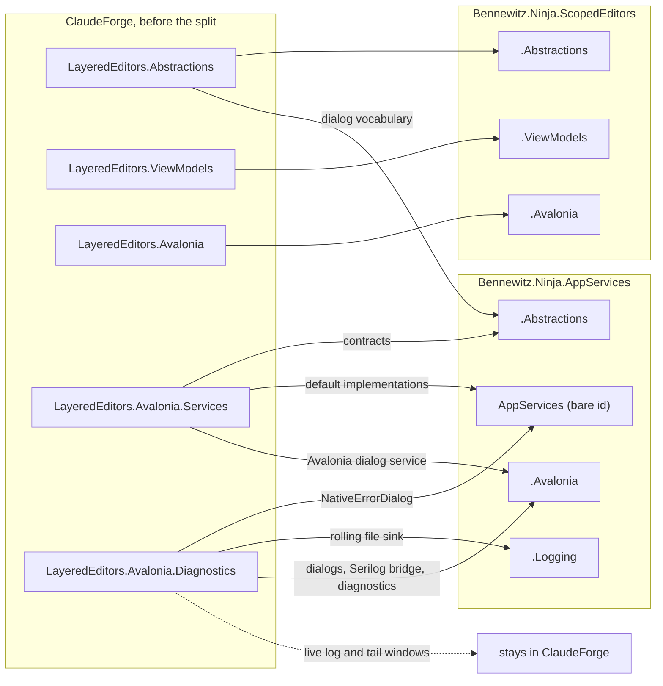

# LayeredEditors renames — what became what, and why

The `LayeredEditors` libraries left ClaudeForge as seven packages in two repositories, and have been
renamed twice on the way. This is every name that changed, when, and the decision behind it.

## The two rounds

| Round | Ships in | What changed | Why | Decided by |
|---|---|---|---|---|
| **1 · The split** | `2026.3.923` | Five `LayeredEditors.*` projects became seven ids in two repositories, `Bennewitz.Ninja.AppServices` and `Bennewitz.Ninja.ScopedEditors`. `LayeredEditors` became `ScopedEditors`, and every id took the `Bennewitz.Ninja.` prefix | A package's identity is its dependency closure: application services and editors share no edge, so they are separate families. "Scoped" names the override model precisely where "Layered" was ambiguous; "Settings" was ruled out because it reads as flat key-value pairs | [`plans/00002`](../plans/00002-layerededitors-becomes-two-package-repositories.md), decisions 1 and 2, from the measured analysis in [`layered-editors-package-split.md`](layered-editors-package-split.md) |
| **2 · `.Avalonia` → `.AvaloniaUI`, inside the packages** | `2026.3.924` | The assembly, namespaces and project folder of the two Avalonia packages. **The package ids keep `.Avalonia`** | AQ1004 found the `Avalonia` namespace segment shadowing Avalonia's own root namespace: inside `…ScopedEditors.Avalonia`, the name `Avalonia.Media.Color` resolves to `…ScopedEditors.Avalonia.Media.Color` and fails with CS0234. The assembly moved with the namespaces, because this family names every namespace `Bennewitz.Ninja.<AssemblyName>`. A package id is not a namespace, so it kept the name consumers know | The developer, 2026-09-23, after AQ1004 reported 8 findings on the published `2026.3.923`. The ids were renamed too at first, and put back the same evening before anything was published, keeping `.AvaloniaUI` where it disambiguates: the namespaces |

The package ids did not change, so `2026.3.924` is the next version of the same two packages, and
nothing is deprecated. ⚠ **Their names no longer match the assembly inside them:**
`Bennewitz.Ninja.ScopedEditors.Avalonia` ships `ScopedEditors.AvaloniaUI.dll`, and an `avares://` URI
names the assembly, so a URI written from the package name points at nothing.

## Where each project went

## Every package

The ids have been the same since `2026.3.923`. Only the two Avalonia packages' assemblies and
namespaces changed in `2026.3.924`.

| Id | Came from, in ClaudeForge | Assembly | Namespace root |
|---|---|---|---|
| `Bennewitz.Ninja.ScopedEditors.Abstractions` | `LayeredEditors.Abstractions`: schemas, scopes, values, workspaces and the severity model, less the dialog vocabulary | `ScopedEditors.Abstractions` | `Bennewitz.Ninja.ScopedEditors.Abstractions` |
| `Bennewitz.Ninja.ScopedEditors.ViewModels` | `LayeredEditors.ViewModels` | `ScopedEditors.ViewModels` | `Bennewitz.Ninja.ScopedEditors.ViewModels` |
| `Bennewitz.Ninja.ScopedEditors.Avalonia` | `LayeredEditors.Avalonia` | `ScopedEditors.AvaloniaUI`; `ScopedEditors.Avalonia` at `.923` | `Bennewitz.Ninja.ScopedEditors.AvaloniaUI`; `….Avalonia` at `.923` |
| `Bennewitz.Ninja.AppServices.Abstractions` | The contracts from `LayeredEditors.Avalonia.Services` (`IShellLauncher`, `IShareService`, `IDialogService`, `IEnvironmentProvider`, `IPermissionPathPicker`, `ISaveChangesPrompt`, `FilePickerFilter`, `ShareOutcome`, `UnsavedChangesChoice`), the dialog vocabulary from `LayeredEditors.Abstractions` (`DialogMessage`, `DialogMessageBuilder`, `DialogSegment`, `DialogSegmentKind`, `DialogCategory`), and four types new in the split: `LaunchResult`, `LaunchStatus`, `DiagnosticSink`, `DiagnosticLevel` | `AppServices.Abstractions` | `Bennewitz.Ninja.AppServices.Abstractions` |
| `Bennewitz.Ninja.AppServices` | `ShellLauncher`, `DefaultShareService` and `DefaultEnvironmentProvider` from `LayeredEditors.Avalonia.Services`; `NativeErrorDialog` from `LayeredEditors.Avalonia.Diagnostics` | `AppServices` | `Bennewitz.Ninja.AppServices` |
| `Bennewitz.Ninja.AppServices.Logging` | `BucketedRollingFileSink` from `LayeredEditors.Avalonia.Diagnostics` | `AppServices.Logging` | `Bennewitz.Ninja.AppServices.Logging` |
| `Bennewitz.Ninja.AppServices.Avalonia` | `AvaloniaDialogService` from `LayeredEditors.Avalonia.Services`; `FatalErrorDialog`, `NonFatalNoticeDialog`, `SerilogAvaloniaSink`, `BindingValidationErrorLogger` and `AvaloniaDiagnostics` from `LayeredEditors.Avalonia.Diagnostics` | `AppServices.AvaloniaUI`; `AppServices.Avalonia` at `.923` | `Bennewitz.Ninja.AppServices.AvaloniaUI`; `….Avalonia` at `.923` |

**Not moved:** `LiveLogWindow`, `LiveTailWindow`, `HeaderLink` and `LiveLogWindowSink` stay in
ClaudeForge. The plan expected `LiveLogWindowSink` to ship under a new name, believing it never
referenced its window. It calls `LiveLogWindow.EnqueueLog` directly, so it stayed with the windows,
and a host now attaches it through `AvaloniaDiagnosticsOptions.ConfigureLogger`. The switches that
drove those windows from `AvaloniaDiagnostics`, such as `ToggleLiveLogWindow`, went with them.

## Names that follow from a package

| Name | Before the split | `2026.3.923` | `2026.3.924` | Rule |
|---|---|---|---|---|
| Package id | `Bennewitz.Ninja.LayeredEditors.*` on ClaudeForge's GitHub Packages feed, which nothing ever resolved. DiffView consumes the unprefixed `LayeredEditors.Avalonia.Diagnostics` `1.0.1`, hand-packed to a folder feed | `Bennewitz.Ninja.ScopedEditors.Avalonia` on nuget.org | unchanged | Every published id carries the `Bennewitz.Ninja.` prefix, which is reserved on nuget.org. The id is set on its own, so it does not follow the assembly |
| Assembly | `LayeredEditors.Avalonia` | `ScopedEditors.Avalonia` | `ScopedEditors.AvaloniaUI` | Assemblies stay unprefixed and are named for their project |
| Namespace root | `Bennewitz.Ninja.LayeredEditors.Avalonia` | `Bennewitz.Ninja.ScopedEditors.Avalonia` | `Bennewitz.Ninja.ScopedEditors.AvaloniaUI` | `Bennewitz.Ninja.<AssemblyName>` |
| `avares://` URI | `avares://LayeredEditors.Avalonia/…` | `avares://ScopedEditors.Avalonia/…` | `avares://ScopedEditors.AvaloniaUI/…` | Names the ASSEMBLY, never the package id, so it moves whenever the assembly does |
| Test project | `LayeredEditors.Avalonia.Tests`, `LayeredEditors.Avalonia.Diagnostics.Tests`, and parts of `ClaudeForge.Tests` | `ScopedEditors.Tests` and `AppServices.Tests`, holding the new layering guards | the same two, with the original suites ported in | One test project per repository, carrying the tests of the code it ships |

The rows show the ScopedEditors Avalonia package. The AppServices one moved the same way: its id is
`Bennewitz.Ninja.AppServices.Avalonia` throughout, and its assembly went from `AppServices.Avalonia`
to `AppServices.AvaloniaUI`. It has no `avares://` URIs.

⚠ **A stale `avares://` URI is not silent, and it fails differently by where it sits.** A
`StyleInclude` in AXAML fails the build with `AVLN2000`; a `FontFamily` naming one family throws
`InvalidOperationException` the first time text in it is laid out; a `FontFamily` with a fallback
list draws the next face and reports nothing.

## Members renamed by the API reshape

The service contracts changed shape before their first publish, which is when that was free, and
the four launcher methods took the `Async` suffix with it.

| Before the split | `2026.3.923` | `2026.3.924` |
|---|---|---|
| `bool LaunchTerminalWithCommand(command)` | `ValueTask<LaunchResult> LaunchTerminalWithCommandAsync(command, cancellationToken = default)` | the token is required |
| `void RevealInFileManager(filePath)` | `ValueTask<LaunchResult> RevealInFileManagerAsync(filePath, cancellationToken = default)` | the token is required |
| `void OpenInDefaultEditor(filePath)` | `ValueTask<LaunchResult> OpenInDefaultEditorAsync(filePath, cancellationToken = default)` | the token is required |
| `void LaunchUrl(url)` | `ValueTask<LaunchResult> LaunchUrlAsync(url, cancellationToken = default)` | the token is required |
| `Task<ShareOutcome> ShareTextAsync(title, text, uri = null)` | `ValueTask<ShareOutcome> ShareTextAsync(title, text, uri = null, cancellationToken = default)` | `uri` and the token are both required |
| `Task<ShareOutcome> ShareFileAsync(title, filePath)` | `ValueTask<ShareOutcome> ShareFileAsync(title, filePath, cancellationToken = default)` | the token is required |

`2026.3.923` made them asynchronous and gave them a result that says which failure happened: the
service API shape in `plans/00002`. `2026.3.924` removed every defaulted `CancellationToken` for
AQ1001; `uri` lost its default with it, because a required parameter cannot follow an optional one
(CS1737).
