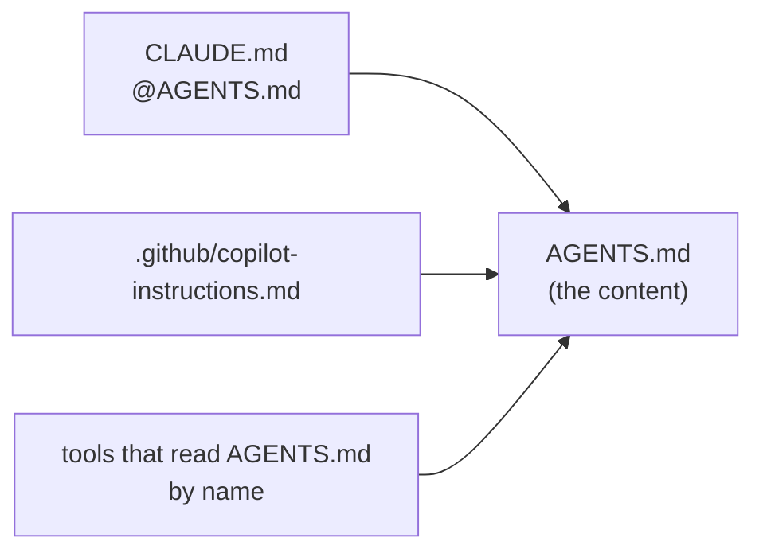

# Repository conventions

Every `Bennewitz.Ninja.*` repository carries the same GitHub settings, the same gates on `main`
and the release tags, and the same documentation layout. This document is where that is
prescribed. [`scripts/repo-conventions.cs`](../scripts/repo-conventions.cs) is how it is enforced:
every repository carries a copy, and its CI runs the copy on every push and pull request.

A repository generated from any of the family's templates starts with all of it in place: `bbpkg`
for a NuGet package, `bbavalonia` for an Avalonia desktop app, `bbweb` for a Kestrel web site and
`bbapi` for a Kestrel API. What generation
cannot know is left as a marker, and CI stays red until every marker is gone. A repository that was
not generated from the template adopts the same files by hand; see
[Bringing an existing repository in](#bringing-an-existing-repository-in).

## What every repository carries

| File | Where | What it is | Checked by |
|---|---|---|---|
| `README.md` | root | For humans. In a package repository it is packed, so it is also the nuget.org description | `check` |
| `PROGRESS.md` | root | The work state: what is published, what is on `main` and not released, what is next. Updated in the same change as the work it describes | `check` |
| `AGENTS.md` | root **and every top-level directory** | For agents: the invariants a change must not break, the commands, and the checklists for recurring work | `check` |
| `CLAUDE.md` | beside every `AGENTS.md` | The single line `@AGENTS.md` | `check` |
| `.github/copilot-instructions.md` | `.github/` | A pointer to the root `AGENTS.md` | `check` |
| `.github/repository.json` | `.github/` | What varies per repository: description, topics, required checks, exemptions | `check` |
| `scripts/repo-conventions.cs` | `scripts/` | The enforcer, identical to the template's copy | `check --repo`, run from this repository |
| A `conventions` CI job | `.github/workflows/ci.yml` | Runs `check` on every push and pull request | the `main` ruleset requires it |
| A preflight step | `.github/workflows/release.yml` | Runs `check --release` before anything is published | the release itself |

A **top-level directory** is any directory at the root that git tracks. `check` reads the list from
the tree, so a directory added later needs its documents on the day it is added.

## The AI-facing documents

The content is written once, in `AGENTS.md`, and addresses no particular agent. Each tool finds its
instructions under its own filename, so each gets a pointer file rather than a copy:



Two copies of the same guidance eventually disagree, and no reader can tell which is current. A
tool added later needs only its own pointer.

**The root `AGENTS.md`** says what the repository is, lists its top-level directories, and holds the
invariants that span the repository, the commands, and the checklists. **A directory's
`AGENTS.md`** holds what only that directory's files show: the rules its build files enforce, the
tests that guard it, and what must not be changed there without reading something first.

Write them **fact-shaped**. Every claim cites a file, a type, a member or a test, so when the code
moves, the stale claim shows up as a name `grep` cannot find. No line numbers, no dates and no
counts: all three go stale without anything noticing.

`PROGRESS.md` is the one document that is about time rather than structure. It is updated in the
same change as the work, and what has stopped changing moves out of it.

### Shared lessons

Some knowledge has one home in the family. Every repository sends what it learns there instead of
keeping a copy, because two copies of a lesson drift and the reader cannot tell which is current.

| Topic | The one living copy | How to send to it |
|---|---|---|
| Avalonia foot-guns: symptom, cause and fix | `docs/avalonia-gotchas.md` in [JanusMael/Bennewitz.Ninja.XamlQuality](https://github.com/JanusMael/Bennewitz.Ninja.XamlQuality) | A message to the XamlQuality session, with the versions and the measurement or source behind it; an issue in that repository when no session is running |
| Making a desktop UI an agent can drive and verify | `docs/ai-drivable-ui.md` in the same repository | The same |

XamlQuality checks each claim before it lands and replies with the outcome. Each repository's root
`AGENTS.md` states the rule, and the template's root `AGENTS.md` ships it to every new repository.
`check` cannot enforce prose, so this is a prescription, not a check.

## Settings

The baseline lives in `Baseline` inside `scripts/repo-conventions.cs`, not in each repository, so
one repository cannot quietly differ from the rest.

| Setting | Value | Why |
|---|---|---|
| Merge commits | off | Linear history; every commit on `main` is a Conventional Commit |
| Squash and rebase merges | on | |
| Auto-merge | unavailable | A merge happens because someone decided it, not because a check went green |
| Delete branch on merge | on | |
| Offer "update branch" | on | `main` requires branches to be up to date |
| Issues | on | |
| Wiki, projects, discussions | off | Documentation lives in the repository, where it is versioned with the code |
| Vulnerability alerts | on | |
| Dependabot security updates | on | A fix arrives as a pull request, gated like any other |
| Topics | include `csharp` and `dotnet`; and `nuget` when `packages.push` names an id | Every family repository is .NET. Only one that publishes to nuget.org is a NuGet package; an app, site or API that packs nothing is not, and the topic would send people looking for one |

### Rulesets

| Ruleset | Applies to | Rules | Who bypasses |
|---|---|---|---|
| `main` | the default branch | No deletion, no force push. Changes arrive by pull request with **0** required approvals and every conversation resolved, merged by squash or rebase. The checks in `requiredChecks` must pass on an up-to-date branch | Repository admins, mode `always` |
| `release-tags` | `refs/tags/v*` | No creation, update or deletion | Repository admins, mode `always` |

⛔ **The bypass mode must be `always`.** GitHub's other mode, `pull_request`, lets an admin bypass
only inside a pull request, which blocks the maintainer's direct pushes to `main`.

**Zero approvals is deliberate.** A solo maintainer cannot approve their own pull request, and an
admin bypasses the rule anyway. The gate that matters is the one agents and contributors meet: a
pull request, green checks, and resolved conversations.

**The tag rule exists because a tag publishes.** Pushing `v*` runs the release workflow, and a
version on nuget.org can never be replaced.

⛔ **Never require a check that no job reports.** GitHub waits for it indefinitely, blocks every
pull request, and never says why. `check` and `apply` both refuse a `requiredChecks` entry that no
workflow job reports.

### Who can see what

GitHub shows part of a repository's settings to anyone and the rest only to its admins. A
workflow's `GITHUB_TOKEN`, which is read-only in these repositories, sees:

| Returned to the workflow's token | Admin only |
|---|---|
| description, homepage, topics | the six merge options |
| `has_issues`, `has_wiki`, `has_projects`, `has_discussions` | `security_and_analysis` (Dependabot) |
| each ruleset's rules, conditions and required checks | who may bypass a ruleset |
| | vulnerability alerts, classic branch protection |

So CI's `check` covers the left column and the documentation, and `check --admin`, run with the
maintainer's `gh` login, covers everything. `check --admin` **fails** on anything it could not
read, because an item that was skipped and an item that passed look identical in a report.

## Build properties

Every project builds with the same standard properties. `check` asks MSBuild what each project in
the repository's solution actually evaluates to, rather than reading the files, because a property
can be set, overridden or imported anywhere: a csproj, a nested `Directory.Build.props`, a package.

- It **restores first**, because a package's build props are imported only after a restore.
- It **evaluates as CI does**, with `GITHUB_ACTIONS=true`. A property set to `$(GITHUB_ACTIONS)` is
  empty on a developer machine and would otherwise pass there.
- It needs a checkout, so it runs in CI's `conventions` job and in `check --offline`. `check --repo`
  reports the properties as out of its reach; `check --release` skips them.

**A project's role** comes from the project itself, taking the first that matches: *template*
(`PackageType` Template), *analyzer* (`IsRoslynComponent`), *test* (`IsTestProject`), *tool*
(`PackAsTool`), *library* (packable), *app* (an executable that is not packable), *other*. The
order matters: an xUnit v3 test project is a non-packable executable.

| Rule | Every project | Libraries and tools |
|---|---|---|
| `TargetFramework` | `net10.0` among its targets; an analyzer, `netstandard2.0` | |
| `Nullable`, `ImplicitUsings` | `enable` | |
| `TreatWarningsAsErrors`, `ManagePackageVersionsCentrally` | `true` | |
| `AssemblyCompany` | `Bennewitz.Ninja` | |
| `AutoVersioning` | references `Bennewitz.Ninja.AutoVersioning` at `2026.3.916` or later, with `GenerateAutoVersionedAssemblyInfo` `true` | |
| `IsContinuousIntegration` | unset | |
| `Authors` | | set |
| `PackageLicenseExpression` | | `MIT` |
| `RepositoryUrl` | | names this repository |
| `PackageReadmeFile` | | set, so nuget.org shows a README; any name, and `dotnet pack` itself fails (`NU5039`) when the named file is not packed |
| `DebugType` | | `embedded` in Release |

**Trimming** is a stage. A library without `IsTrimmable` and `EnableTrimAnalyzer` is a NOTE until
`repository.json` says `"trimming": "required"`, and then it fails. Apps and tools are not held to
it: a `dotnet tool` runs on the installed framework, and an app's trimming is decided by its kind.

**A rule can be exempted for one project**, under `props` in `repository.json`, with its reason. The
rule names are the ones in the table above, plus `Trimming`. An exemption the project no longer
needs is reported, so it is removed rather than left to hide a later regression.

## `.github/repository.json`

Only what varies from one repository to the next:

```json
{
  "description": "One sentence: what it is, then \"Ships as\" and the package ids.",
  "homepage": "",
  "topics": ["csharp", "dotnet", "nuget", "avalonia"],
  "requiredChecks": ["build", "pack", "conventions"],
  "content": [],
  "undocumented": {}
}
```

| Key | Meaning |
|---|---|
| `description` | The GitHub description. Empty fails `check`, including at release |
| `homepage` | The GitHub homepage URL, usually empty |
| `topics` | Must include the family topics: `csharp` and `dotnet`, and `nuget` when `packages.push` names an id |
| `requiredChecks` | The check names the `main` ruleset requires: a job's `name:`, or its id when it has none. A matrix job reports one check per combination, such as `Build (ubuntu-latest)` |
| `content` | Paths whose Markdown is shipped content rather than this repository's own documentation, so a marker inside them is intended. This repository lists `templates/bbpkg` |
| `undocumented` | Top-level directories exempt from `AGENTS.md`, each mapped to its reason. An empty reason fails |
| `props` | Per-project exemptions from the [build properties](#build-properties): `{ "<project>": { "<rule>": "<reason>" } }`. An empty reason fails |
| `trimming` | `"required"` once every library in the repository is trimmable; absent until then |

## Commands

```bash
dotnet run --file scripts/repo-conventions.cs -- check
dotnet run --file scripts/repo-conventions.cs -- check --admin
dotnet run --file scripts/repo-conventions.cs -- apply --dry-run
dotnet run --file scripts/repo-conventions.cs -- apply
```

| Command | Run by | What it does |
|---|---|---|
| `check` | CI, on every push and pull request | Documentation, markers, description, topics, homepage, feature toggles, rulesets, required checks |
| `check --release` | the release workflow | Only what is prescribed: the documents, the markers and a non-empty description. A drifted setting does not stop a publish |
| `check --admin` | the maintainer | Everything, including the merge options and security toggles; fails on anything unreadable |
| `check --offline` | `verify-release`, a maintainer without network access to GitHub | Only what the checkout shows: the documents, the required checks against the workflows, the build properties, and the script copy |
| `apply --dry-run` | the maintainer | Prints every request `apply` would send |
| `apply` | the maintainer | Writes the description, homepage, topics, baseline settings, security toggles and both rulesets |
| `apply --replace-branch-protection` | the maintainer, once | Also deletes classic branch protection, after the `main` ruleset exists |
| `--repo OWNER/NAME` | any of the above | Acts on another repository, reading its files through the API. From this repository, it also reports a `scripts/repo-conventions.cs` that differs from the template's |

`dotnet run --file` rather than `dotnet run`: in a directory with a `.csproj`, `dotnet run <file>`
binds to the project instead.

## Starting a new repository

What generation does is marked ✅; the rest is yours.

1. ✅ `dotnet new <template> -n <Stem> --RepoOwner <owner>`, with `bbpkg`, `bbavalonia`, `bbweb`
   or `bbapi`, writes every file in the table above. An app template also takes `--RepoName` when
   the repository is not named after the app, and `bbweb` takes `--blazor`.
2. Create the GitHub repository and push `main`. CI goes red on the `conventions` job, listing
   every gap. That is expected.
3. In `.github/repository.json`, write the description and add topics beyond the family's.
4. Replace every `<!-- bbpkg: … -->` marker: the root `README.md`, `AGENTS.md` and `PROGRESS.md`,
   and each directory's `AGENTS.md`. Every template uses this one marker. Delete an example that
   does not apply rather than leaving it.
5. Run `apply`, then `check --admin`. Both need the maintainer's `gh` login.
6. Push. The `conventions` job goes green.
7. For a package, set up trusted publishing:
   [`docs/publishing.md`](../templates/bbpkg/docs/publishing.md) in the generated repository. An
   app releases to GitHub Releases with no credential to set up; its `docs/releasing.md` says how.

## Bringing an existing repository in

1. Copy `scripts/repo-conventions.cs` from this repository's `templates/bbpkg/scripts/`.
   ⛔ **A project at the repository root compiles it**, because an SDK project's default glob takes
   every `.cs` beneath it, and the build fails with `CS9314` on the script's `#!` line. Add
   `scripts\**` to that project's `DefaultItemExcludes` in the same change, and run the
   repository's own build before pushing: `check` compiles the script alone and cannot see this.
2. Write `.github/repository.json`, listing in `requiredChecks` only jobs that already exist.
3. Add the `conventions` job to CI and the preflight step to the release workflow, as the template's
   workflows have them.
4. Write the documents. A directory that holds nothing written by hand, such as committed build
   output, goes in `undocumented` with its reason. The root `AGENTS.md` carries the
   [shared lessons](#shared-lessons) rule, as the template's does; `check` cannot see whether it
   is there.
5. Run `apply`, then `check --admin`.
6. Once the `conventions` job is green, add it to `requiredChecks` and run `apply` again. Required
   while red, it would block every pull request in the meantime.

## When the convention changes

Change `templates/bbpkg/scripts/repo-conventions.cs` and this document together, then copy the
script over `scripts/repo-conventions.cs` here. Run from this repository,
`check --repo <owner>/<name>` then reports every repository whose copy is now behind, until each
has been updated.
