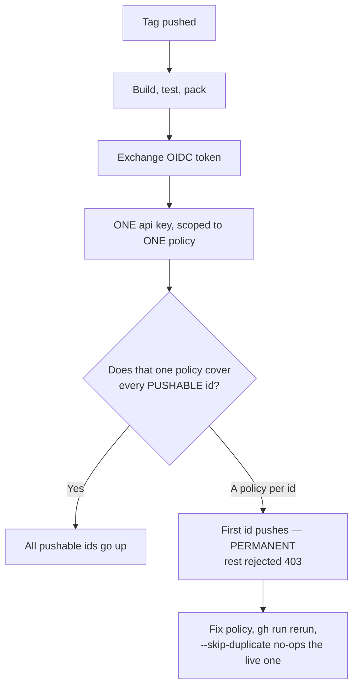

# 00001 — A template repo for .NET NuGet packages

> Status: **approved 2026-09-20**. Supersedes nothing.

Going from "no GitHub project" to "published, verified NuGet package" currently costs a day and a
half-failed release. `Bennewitz.Ninja.XamlQuality` reached `2026.3.920` on 2026-09-20 through two
failures that were both avoidable and are both encodable. This turns that run into a template.

## Why now

| Repo | release.yml | Credential preflight | Publishing doc | Packable | Pushable |
|---|---|---|---|---|---|
| Bennewitz.Ninja.XamlQuality | ✓ | ✓ | ✓ | 2 | 2 |
| Bennewitz.Ninja.FileServer | ✓ | ✓ | — | 1 | 1 |
| Bennewitz.Ninja.AutoVersioning | ✓ | — | — | 1 | 1 |
| chisel | ✓ | — | — | 1 | 1 |
| **Bennewitz.Ninja.DiffView** | ✓ | — | — | **3** | **2** |

Five repos, five different workflows. DiffView has three package ids and **one must never reach
nuget.org**, which is the case a naive template gets catastrophically wrong.

## What went wrong on XamlQuality

| Failure | Cost | What the template must do |
|---|---|---|
| `NUGET_USER` held a value nothing had ever validated | One failed run, 401, cause invisible | Ship the preflight, so the secret is exercised before a tag exists |
| Two trusted-publishing policies, one per package id | **Half a release permanent**: library published, tool 403 in the same command | Scaffold one policy carrying every pattern needed |

nuget.org mints **one** API key per token exchange, scoped to **one** matching policy. Two policies
matching identical OIDC claims means one is chosen and the other's package is rejected — after the
first push is already permanent.



## Packed is not pushable

DiffView disproves the tempting assumption. `dotnet pack` over its solution produces
`Bennewitz.Ninja.ThemeAudit`, which is **local-feed-only by design** — `NuGet.config` maps that exact
id to `../nuget-local`, `release.yml` names push targets explicitly, and
`PackagingTests.The_release_workflow_names_the_packages_it_pushes` fails if a glob returns.

So the template tracks **two** sets. Both are newline-delimited package ids, `#` comments allowed,
because a test and a workflow both machine-read them:

| File | Meaning |
|---|---|
| `packages.push` | ids that go to nuget.org, named explicitly in the push |
| `packages.local` | ids that pack but must **not** be published; the reason goes in a `#` comment above each |

A test asserts `packed == push ∪ local`, so a new packable project fails the build until somebody
classifies it.

⛔ **Ids are read from the `.nuspec` inside each `.nupkg`, never parsed from the filename.**
`<id>.<version>.nupkg` is not decidable lexically — nothing distinguishes an id ending in
`XamlQuality` from one ending in `XamlQuality.2026`.

This also fixes the policy rule. The nuget.org field is *Glob Patterns and Packages* — plural — so
**one** policy carries however many patterns the pushable set needs. It must cover every id in
`packages.push` and **match nothing** in `packages.local`. For DiffView `Bennewitz.Ninja.DiffView*`
satisfies both; widening to `Bennewitz.Ninja.*` would silently authorise the forbidden id.

## Two repos, two release workflows, and only one of them is easy to prove

This is the trap that makes the template different from an ordinary package repo.

| Workflow | Lives at | Publishes | Runs when |
|---|---|---|---|
| The template's own | `.github/workflows/release.yml` | `Bennewitz.Ninja.PackageTemplate` | Every template release |
| **The one that ships** | `templates/bbpkg/.github/workflows/release.yml` | the generated repo's library and tool | **Never here** — Actions only reads the repository root |

⛔ **The template releasing itself does not prove the workflow it ships.** The shipped one is inert
inside the template content until some future repo cuts its first tag. They cannot be the same file:
making the repo root the template root would have `sourceName` rewrite the packaging project's own
`PackageId`, so every generated repo would inherit a `PackageType=Template` project trying to
publish itself.

So the shipped workflow is proved two ways, neither of them a real publish:

1. The packaging tests run against **both** files — the root one directly, the shipped one by path
   from the template repo's own test project.
2. A CI job generates a repo from the template and executes the generated workflow's **logic** —
   build, test, pack, and the two-list assertion — stopping before login and push.

⚠ This is weaker than a real publish and the plan says so rather than implying otherwise. The first
generated repo's first release remains the first time the shipped push path runs for real.

## Mechanism

The repo is a GitHub template **and** a `dotnet new` template — verified on SDK 10.0.401, including
directory renames, filename renames and content substitution in one pass.

```
gh repo create <name> --template JanusMael/Bennewitz.Ninja.PackageTemplate   # GitHub route

dotnet new install Bennewitz.Ninja.PackageTemplate                           # SDK route
dotnet new bbpkg -n <Stem> --RepoOwner <login>
```

### Two names, not one

`Directory.Build.props` documents the convention: *assembly names stay unprefixed*, namespaces and
package ids carry `Bennewitz.Ninja.`. XamlQuality proves it — project `XamlQuality`, `AssemblyName`
`XamlQuality`, `PackageId` `Bennewitz.Ninja.XamlQuality`.

⛔ **A single `sourceName` cannot produce both.** Passing `-n Bennewitz.Ninja.Foo` yields
`RootNamespace` `Bennewitz.Ninja.Bennewitz.Ninja.Foo` — verified by evaluating the real props file.
Passing `-n Foo` fixes the namespace and breaks the id, the prefix reservation and the policy
pattern. So `-n` takes the **unprefixed stem**, and a derived symbol with a `valueForm` builds the
prefixed id from it.

### Layout

```
Bennewitz.Ninja.PackageTemplate.csproj     PackageType=Template, packs the tree below
templates/bbpkg/                           the template root — NOT named "content"
  .template.config/template.json
  src/PkgStem/ …                           sourceName = PkgStem
  .github/workflows/release.yml            the shipped workflow
```

⛔ **`ContentTargetFolders` alone is not safe.** Two failure modes, both reproduced:

- A source folder named `content` packs to `content/content/…` and is never found.
- Content outside the packaging project's cone **flattens**, dropping `.template.config/`
  entirely — and the resulting package still installs, still lists, still "generates", emitting the
  extracted nupkg instead of a project.

So content items carry an explicit
`PackagePath="content\%(RecursiveDir)%(Filename)%(Extension)"`, and the verification asserts the
generated tree, never an exit code.

### Packing a template under this family's props

⛔ **`dotnet pack` fails out of the box** — reproduced twice, independently:

```
error NU5128: Warning As Error: ... Add lib or ref assemblies for the net10.0 target framework
```

`Directory.Build.props` sets `TargetFramework` and `TreatWarningsAsErrors`; a template package has
no `lib/` by design. The packaging project needs `<NoWarn>$(NoWarn);NU5128</NoWarn>`,
`GenerateDocumentationFile=false` and `SuppressDependenciesWhenPacking=true`.
`IncludeContentInPack=false` is **not** a workaround: it drops the README the props packs and pack
dies with NU5017 instead.

## Decisions

| Decision | Choice | Why |
|---|---|---|
| Naming | Repo and package both `Bennewitz.Ninja.PackageTemplate`; short name `bbpkg` | The repo is named for the package stem, as every package repo here is |
| Policy pattern | Stem-scoped per repo, e.g. `Bennewitz.Ninja.XamlQuality*` | The **prefix reservation** needs `Bennewitz.Ninja.*`; the **policy** must never have it, or it authorises every id in the family |
| Mechanism | GitHub template **and** `dotnet new` template in one repo | Both entry points; the SDK does the renaming |
| Substitution | `-n` takes the unprefixed stem; a derived symbol builds the prefixed id | One `sourceName` cannot yield both |
| Skill | Source in **`bb-skills/package-release/`**, installed globally by the existing `Install-Skills.ps1` | That installer already does timestamped backups, `-WhatIf`, name validation and the dot-source guard `CLAUDE.md` requires; a second installer would duplicate or silently omit all four |
| Skill index | A row in `bb-skills/README.md`, written to that file's house style | A skill living in the template repo would appear in neither the index nor the style |
| Skill safety | **Declines in repos it does not recognise** | Global means it fires in FileServer, AutoVersioning and chisel too — all three glob their pushes and have no two-list files |
| Package sets | Two lists, asserted against `.nuspec` ids | Packed ≠ pushable |
| Nothing globbed | Neither `dotnet nuget push` **nor `gh release create`** | A glob publishes whatever is in the folder |
| Assertion form | A **C# test**, not shell | House convention; runs via `dotnet test` in CI and release alike |

### Alternatives dismissed

- **A hand-rolled bootstrap script** — reimplements `sourceName`, and would substitute a dotted id
  across 101 occurrences in 50 files with shell regex, which `CLAUDE.md` *Never build content or
  patterns through a shell* exists to prevent.
- **Shell scripts for the assertion** — the house convention is logic once in a C# file-app with
  thin launchers; DiffView already proves the `.nuspec` read in C#.
- **A copy of the skill in every generated repo** — a wrong skill would be wrong in N places.
- **Converging all five repos** — a large diff across working, published repos.

## What the preflight can and cannot prove

It proves `NUGET_USER`, `id-token`, and that *a* policy matched. It is **blind** to whether that
policy's patterns cover every id — `docs/publishing.md:90` says so directly, and that gap is what
cost the first `2026.3.920` run.

**So the preflight prints the exact Glob Patterns string computed from `packages.push`, and the
`packages.local` ids labelled "this pattern must NOT match these".** The eyeball comparison is the
real gate; the template's job is to make the thing compared machine-generated rather than remembered.

## What the template must not inherit

1. **`gh release create` globs** (`release.yml:155`). Harmless where every packed id is pushable — so
   it stands in XamlQuality — and wrong the moment one is not.
2. **Every package ships the repo-root README** (`Directory.Build.props:62`, `:39`). Untreated, a
   generated package publishes the *template's* README to nuget.org as its description, permanently.

## Scope

**In:** the template repo; the packaging project; `.template.config/`; a working skeleton (library,
optional tool behind a template flag, test project); `ci.yml` and `release.yml` for **both** the
template and the shipped content; the packaging tests generalised from DiffView; `docs/publishing.md`;
`verify-release` (net-new — no such script exists today); `PROGRESS.md`; the template's own first
release.

**In, but in `bb-skills`:** the `package-release` skill and its row in that repo's README. No new
installer — `Install-Skills.ps1` already does the job.

⛔ **The skill lands in `~/.claude/skills/`, so its exact text is approved before it is installed**,
as a `*.proposed` file in the repo rather than a temp file. `CLAUDE.md` governs anything under
`~/.claude/` that steers how the assistant works.

**Out:** FileServer, AutoVersioning, chisel — all three glob their pushes and have no two-list files;
the skill must decline there rather than advise. Automating the nuget.org policy — a web UI,
account-owner only. **DiffView**, which is `plans/00002`: it has never released, so applying this is
its first release rather than a retrofit.

## Steps

| # | Step | Verification |
|---|---|---|
| 1 | Create the repo; commit this plan alone | `git log` shows one commit, the plan |
| 2 | Packaging project + `templates/bbpkg/` skeleton, with the NU5128 block and explicit `PackagePath` | `dotnet pack` succeeds and the `.nupkg` contains `content/templates/bbpkg/.template.config/template.json` |
| 3 | `template.json`: stem `sourceName`, derived prefixed id, `RepoOwner`, optional-tool flag | Install **from the packed `.nupkg`**, never from `.`; generate; assert `RootNamespace`, `AssemblyName` and `PackageId` are all correct, the tree has no `_rels`/`.nuspec`, and it builds, tests and packs |
| 4 | Packaging tests generalised from DiffView, run against **both** release workflows | Fixture-tested on: agreeing, missing id, unclassified id, an id colliding with its version segment, and a globbed push in either file |
| 5 | Both `ci.yml`s and both `release.yml`s; preflight prints the computed pattern | A CI job generates from the template and runs the shipped workflow's logic through pack, stopping before login |
| 6 | The `package-release` skill, in `bb-skills`, proposed as `*.proposed` before it installs | Asserts the **disproven** values are absent, house-style conformance (`>-` description, numbered headings, under 60 lines), a README row, and — as a fixture — that the skill **declines** when run against `chisel`'s tree |
| 7 | `verify-release`: pack → local install | Run against the template's own packed output, before anything is published |
| 8 | Release the template; mark the repo as a GitHub template; feed-poll and published-install | `dotnet new install <id>` from nuget.org, then **generate and assert the tree**, not the exit code |
